# Module 2 Virtualization and Cloud Basic 

## AWS 

1. Registered with AWS
2. Took  look at Amazon Lightsail, launched a virtual machine:

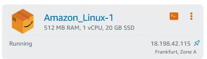

and succeeded to set a connection:

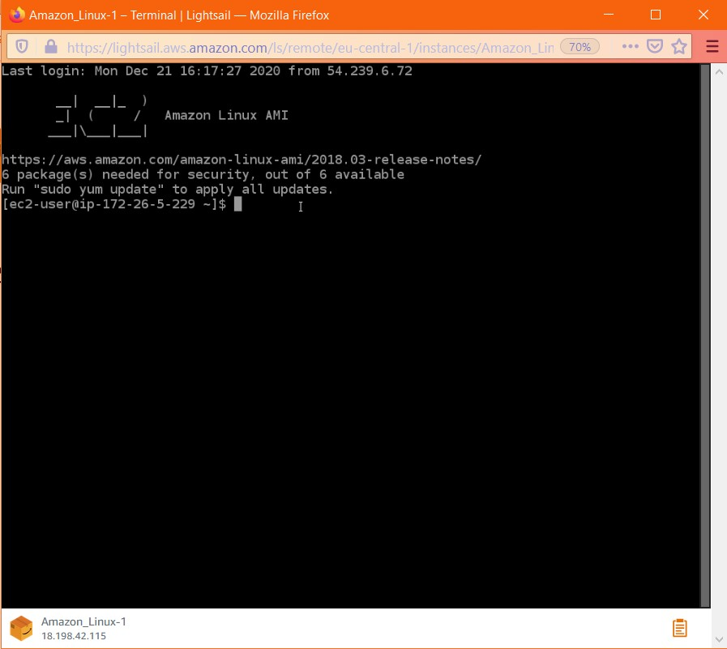

3. Learnt EC2, launched a CentOS:

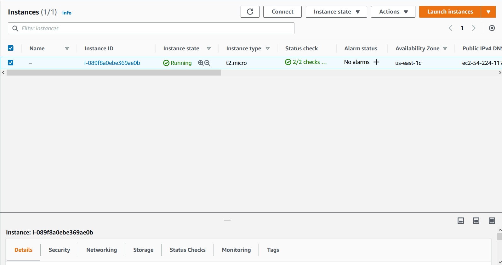

ant set a connection through Putty:

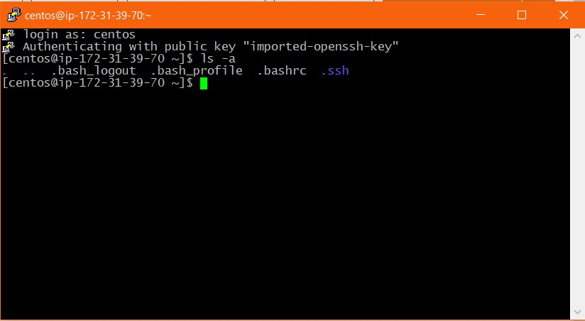

4. Created a backup of the system: 

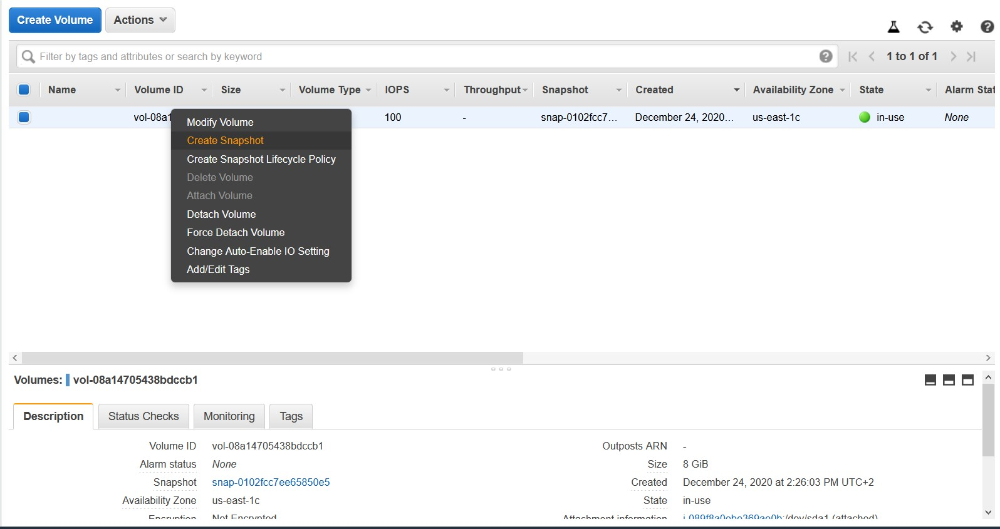

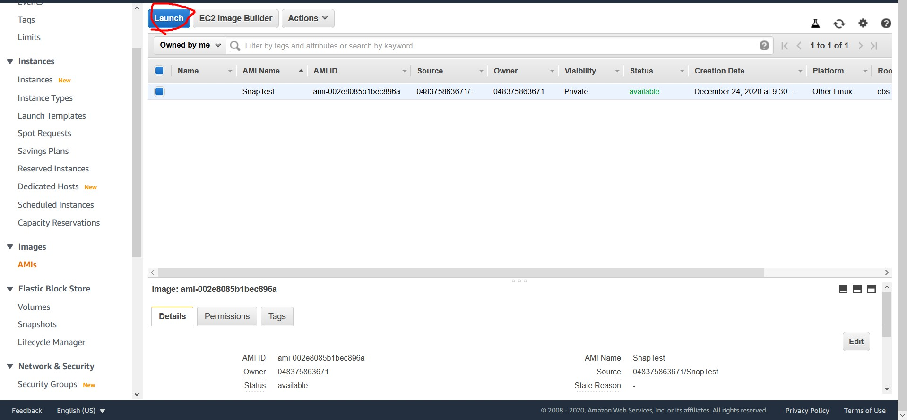

5. Created and attached additional volume to the instance: 

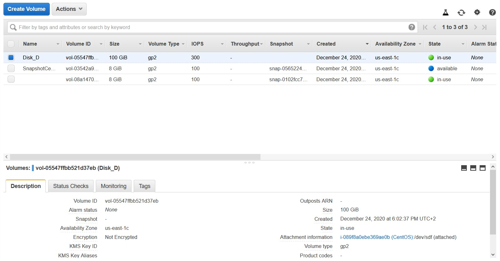

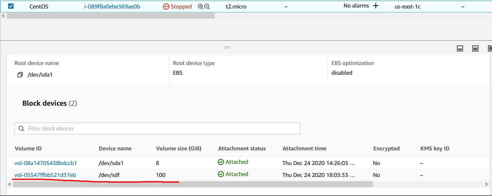

6. Launched new instance from backup

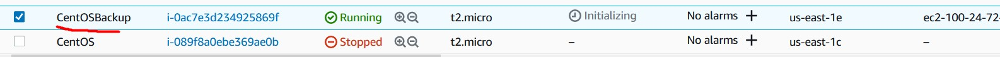

7. Launched  WordPress instance with Amazon Lightsail:

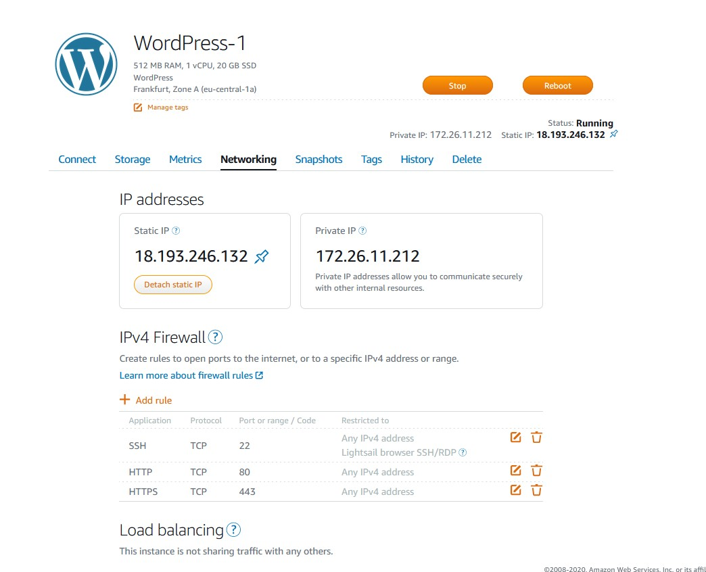

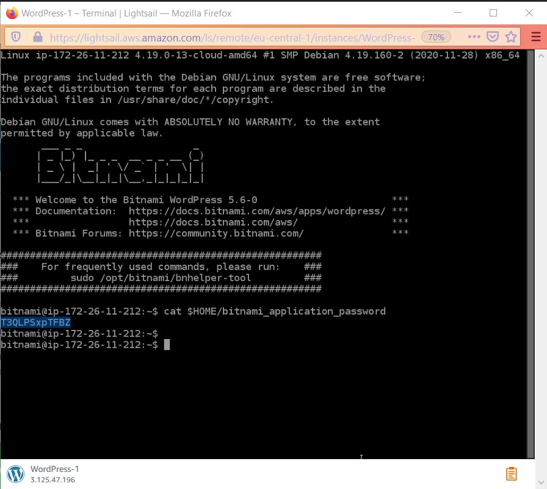

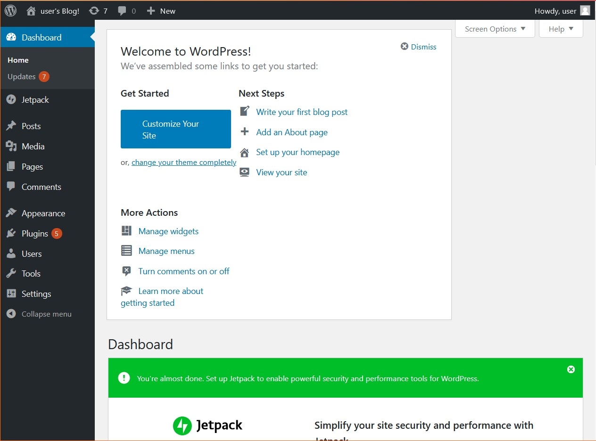

8. Created own repository in S3 and a file:

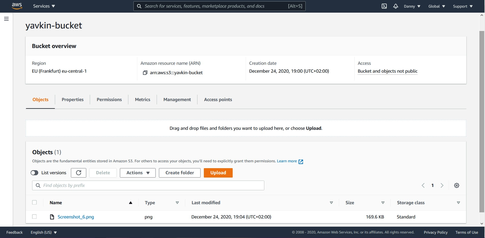

9. Uploaded, downloaded and deleted some files in repository using AWS CLI:

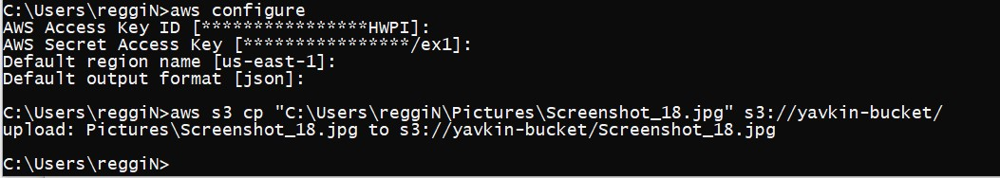
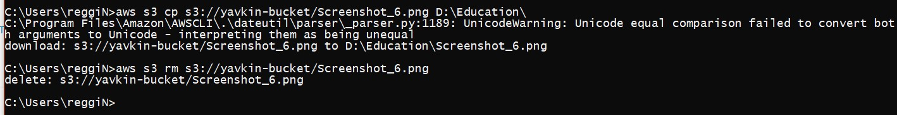

10. Created a cluster and ran an application with Amazon ECS:

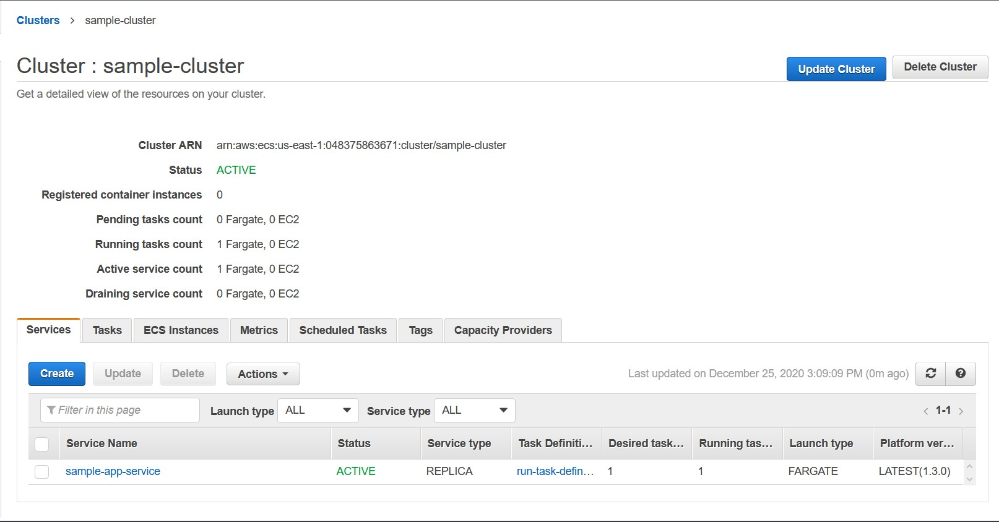
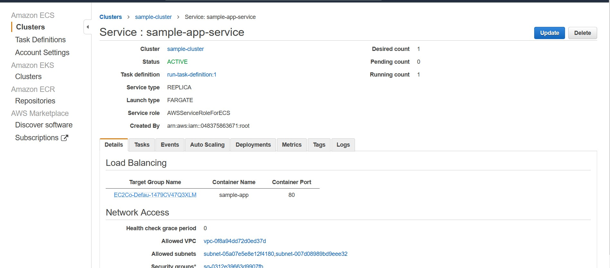
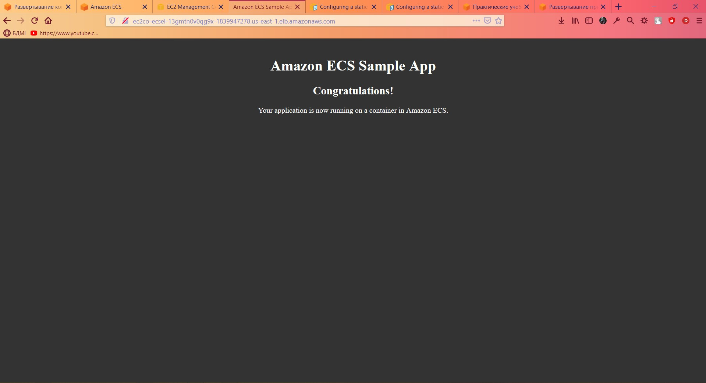

Created a static website using Amazon S3:
  http://yavkin.com.s3-website.eu-central-1.amazonaws.com/
  
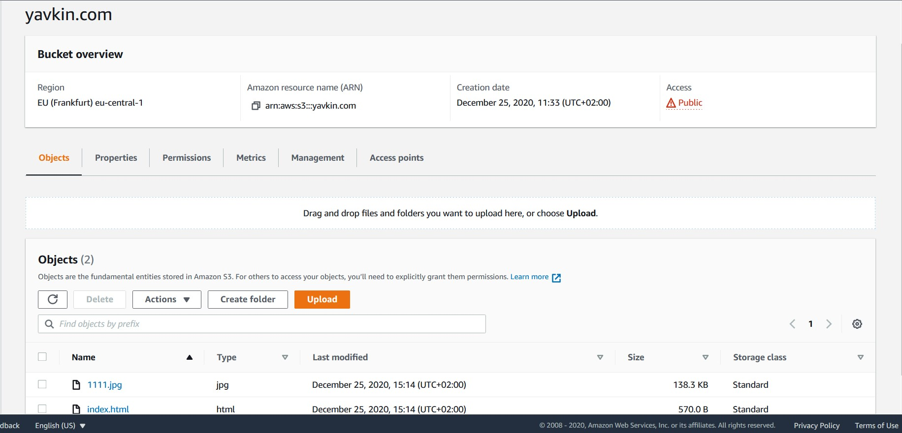
