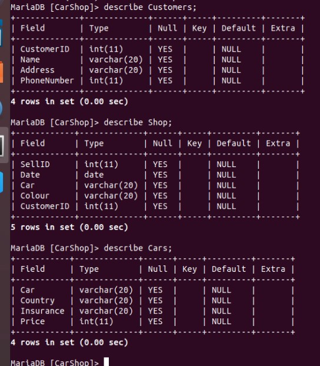
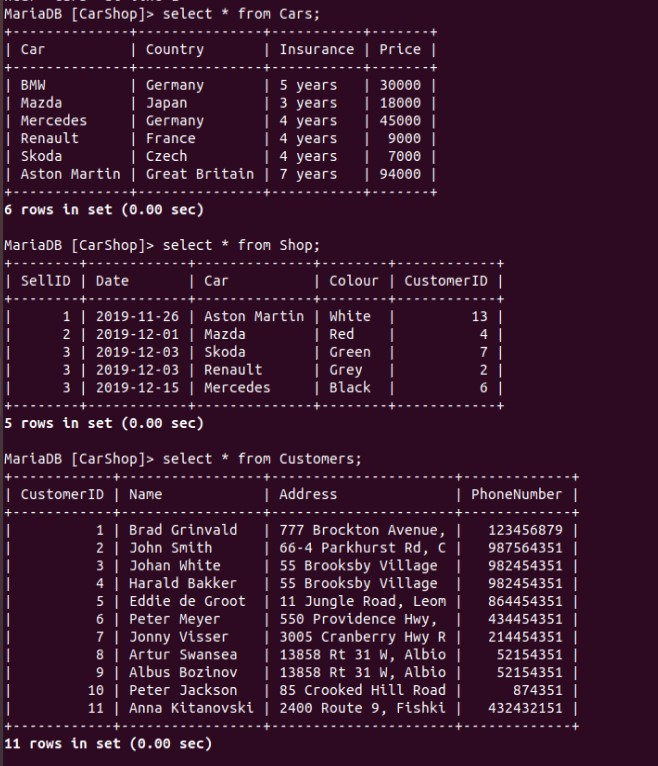
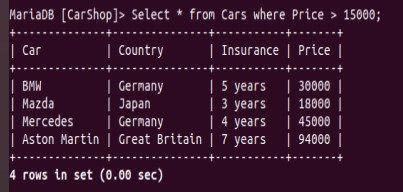
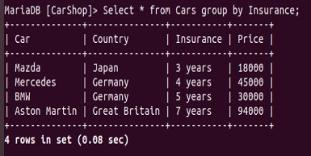
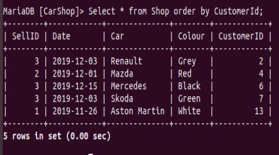
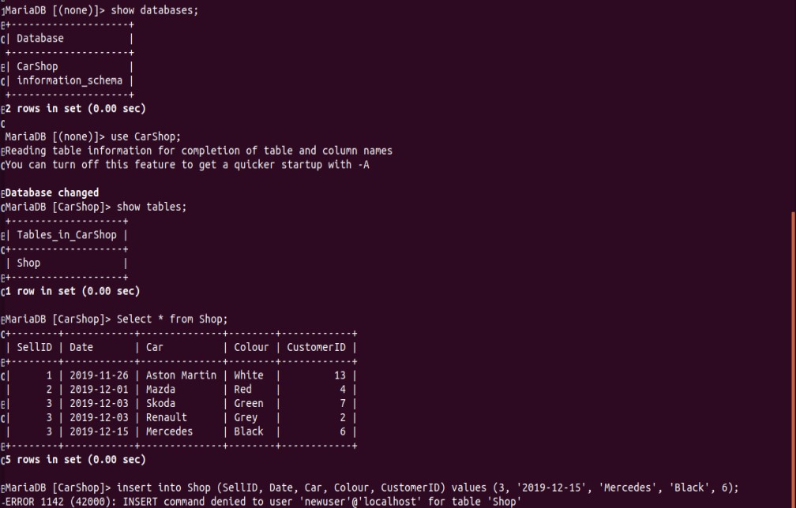

# Module 3 Database Administration 

### PART 1 

1. Installed MySQL on Ubuntu

2. Created new DB CarShop with 3 Tables - Shop, Cars, Customers:

3. Filled in the tables, so now they look like that:

4. Executed some SQL queries using operators:
- WHERE

- GROUP BY

- ORDER BY

5.  Executed other different SQL queries DDL, DML, DCL.  

DDL( defines the database structure ):

- create table Cars (Car varchar(20), Country varchar(20), Insurance varchar(20),  Price int);

- create table Shop (SellID int, Date date, Car varchar(20), Colour varchar(20), CustomerID int);

DML ( allows you to modify the database instance by inserting, modifying, and deleting its data ):  

- insert into Customers (CustomerID, Name, Address, PhoneNumber) values (10, 'Peter Jackson', '85 Crooked Hill Road, Commack NY 11725', '874351');

- Delete from Customers where Address='2400 Route 9, Fishkill NY 12524';

DCL (It gives rights & permissions for users) :

- Grant select on Shop to 'newuser'@'localhost';

6.  Created newuser with SELECT privilege on Shop TABLE with the command:

- Grant select on Shop to 'newuser'@'localhost'; 

SO then I connected to db as a newuser and here are some results:

### PART 2 

### PART 3 

