# Module 4 Networking Fundamentals

### TASK 4.1 

1. Built this topology

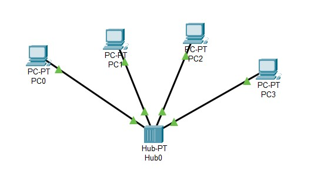

2. Tested topology by sending ICMP packets from PC0 to PC3: 

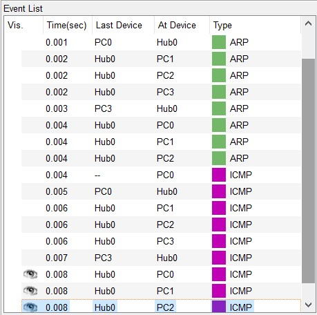

3. Looked to the PDU information: 

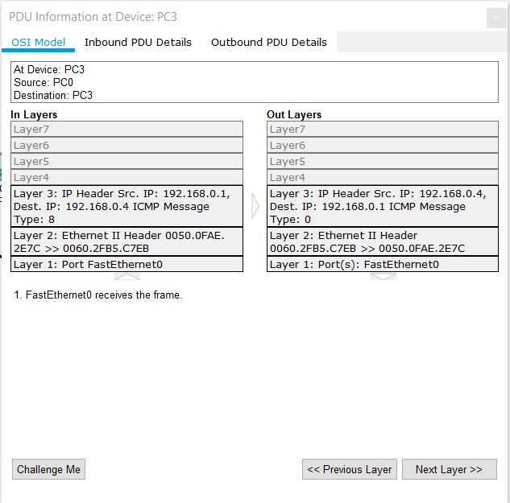

4. Deleted IP-addresses and obviously topoligy stopped working because it is unknown source and destination addresses

5. Expanded topology by adding one more hub, server and 2 PCs

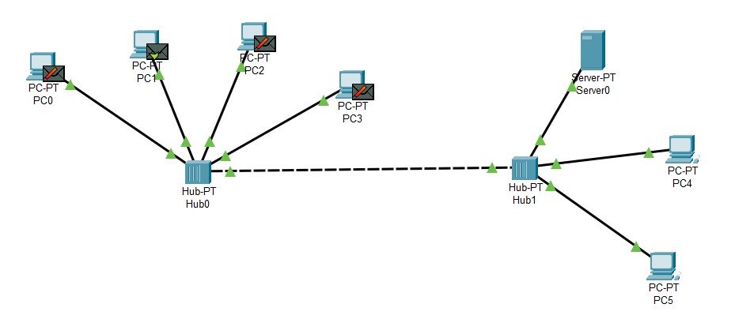

6. Tested topology by sending ICMP packets from PC1 to Server0

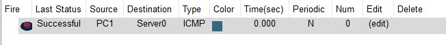

7. Built the same to the first topology but using switch in stead of hub

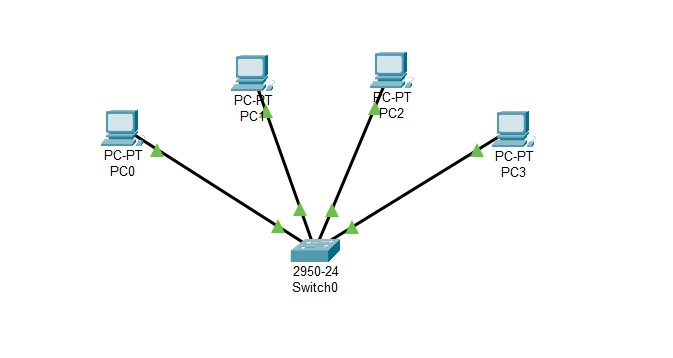

8. Tested topology and looked to the PDU information: 

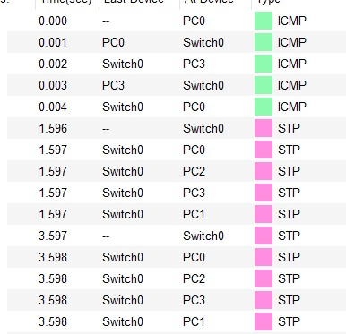

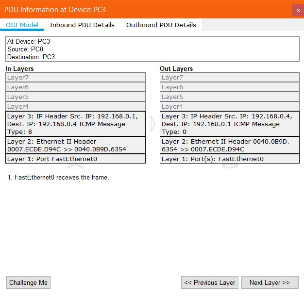

9. Expanded topology by adding one more switch, server and 2 PCs. Tested it

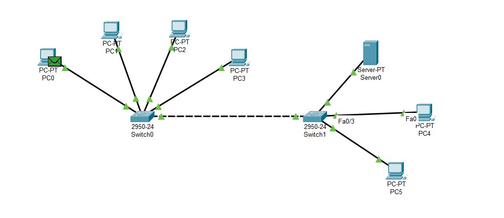

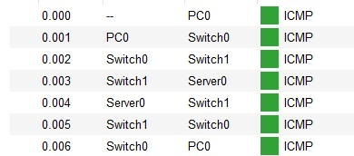

10. To Sum up, the main difference between 2 topologies is the work principes of hub and switch. Hub repeats all packeges it receives. Switch is smarter device and it understands (with the help of ARP-tables, which contain all the MAC and IP-addresses , and STP, that is checking every 2 seconds topology changes with BPDU packets) where it should retranslate the package.

11. Changed Topology: 

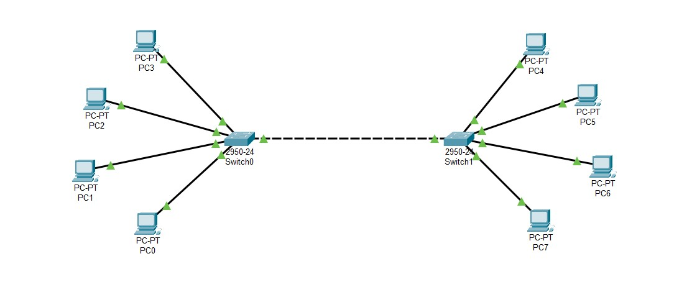

12. Tested it

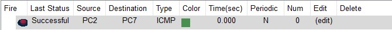

13. Added router in topology

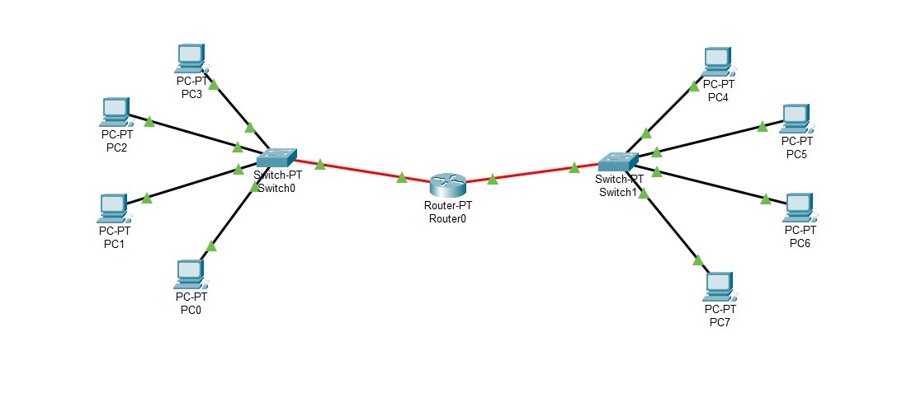

14. Tested the topology by sending  ICMP packets from PC2 to PC7

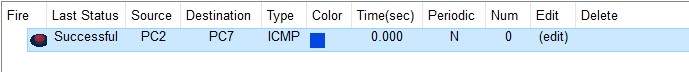

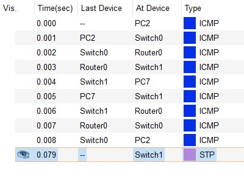

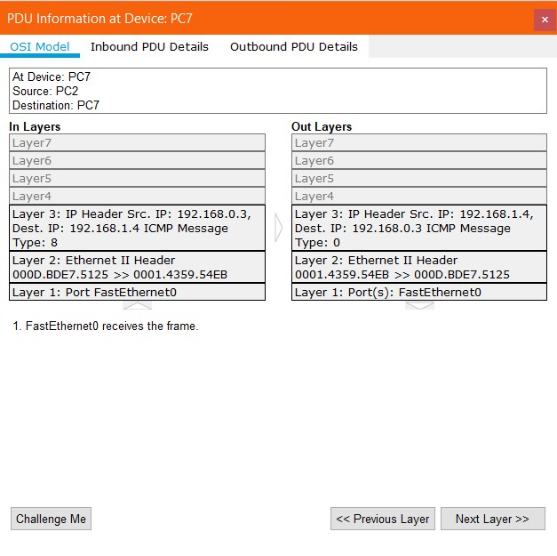

15. Comparing this topology with the previous, it is obvious that the last one gives more opportunities -  network can be separated, so that more IP-addresses are available. As a result much bigger and complicated networks can be built.
