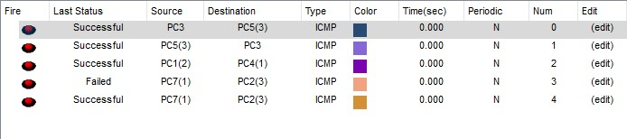
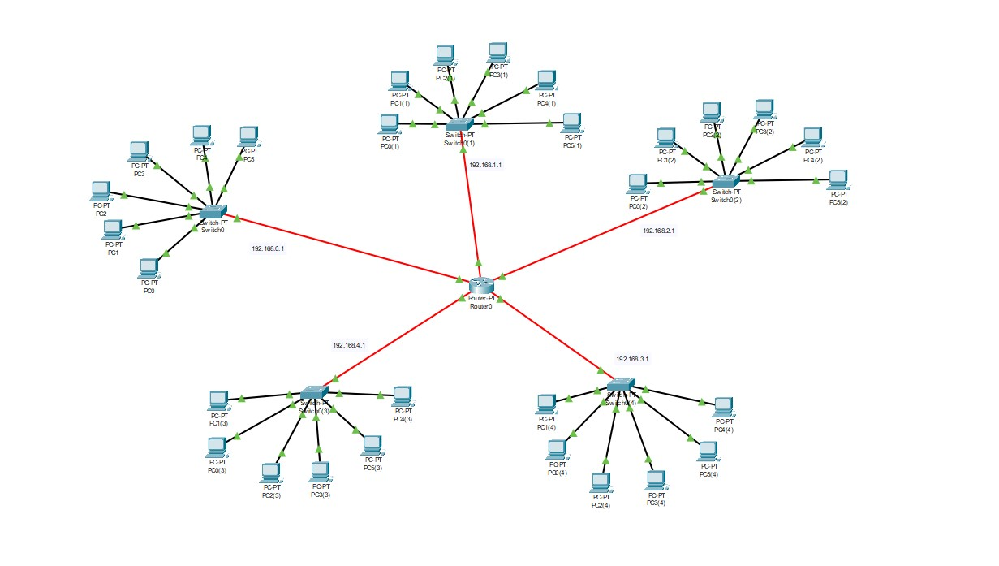

# Module 4 Networking Fundamentals

### TASK 4.2 

#### TASK 1
1. Built the next topology for 2 buildings with 2 floors in each one:

2. Configured it, and tested the connection:

#### TASK 2

1. Built the next topology for 1 building with 4 floors and 8 subnetworks:

2. Configured it, and tested the connection:

#### TASK 3

1. Built the next topology for 5 1 floor buildings with 6 PCs in each:

2. Configured it, and tested the connection:

