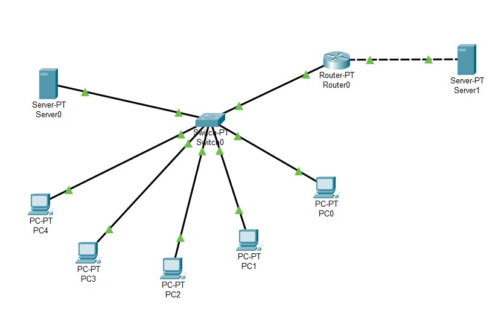
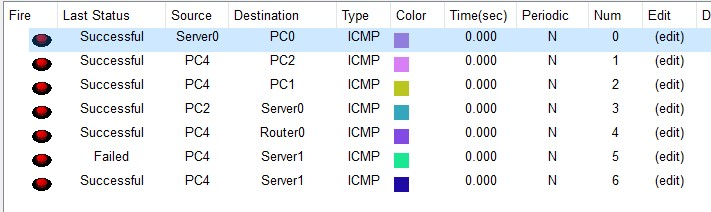

# Module 4 Networking Fundamentals

### TASK 4.3

1. Built aa topology which has a switch with 5 PCs and Server connected to it. Switch and one more server are connected to router.

2. Configured devices and tested a connection: 

