# Module 5 Linux

## TASK 5.1 

### PART 1

1. Logged in as root and changed password.

Password change has changed system files /etc/passwd and /etc/shadow, because they contain the user's password.

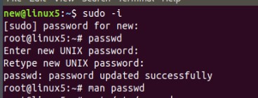

2. Command passwd has the next parameters:

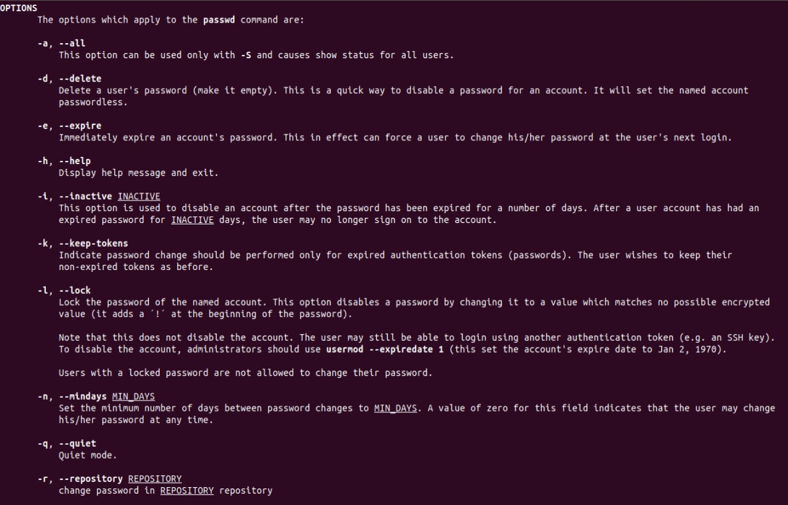

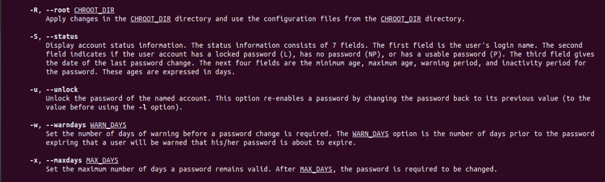

3. List of users:

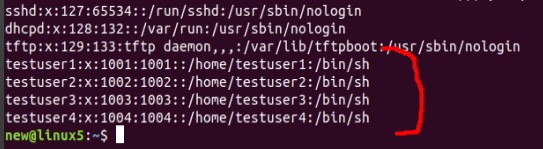

Users permisions: 

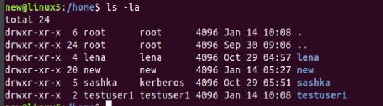

Logged in as a testuser1 and checked the permisions:

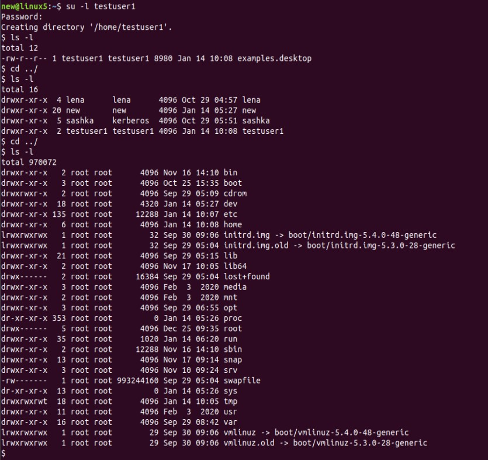

4. Added a description to testuser1 with the help of command `sudo usermod -c 'just a test user' testuser1`:

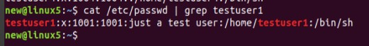

Then tried `chfn testuser1` command:

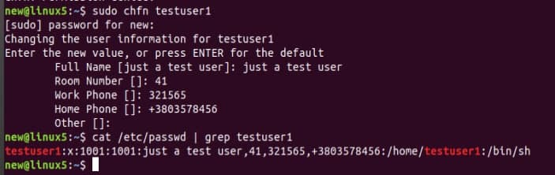

5. Tested 2 commands `--help` *(shows short description about of options)*  and `man` *(shows full description of command)*

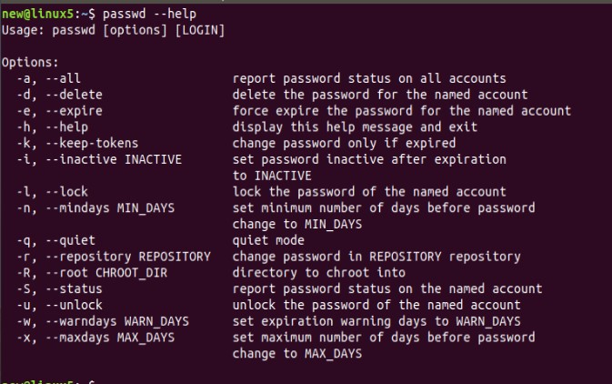

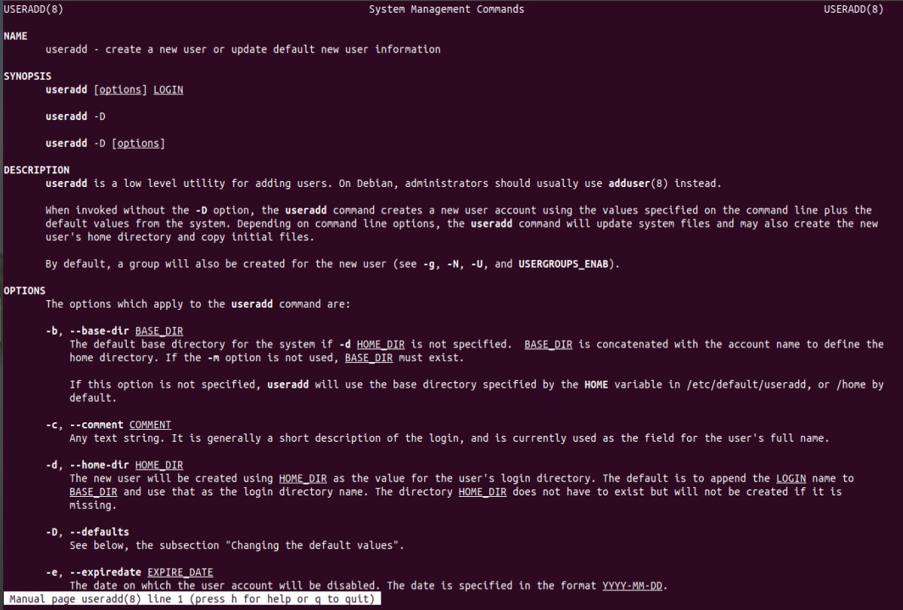

6. Explored `more` and `less` commands and the main difference is that less command is faster because it does not load the entire file at once and allows navigation though file using page up/down keys and it has a useful feature - `/word-to-seach` option

7. Described in plans that I'm working on laboratory work 1:

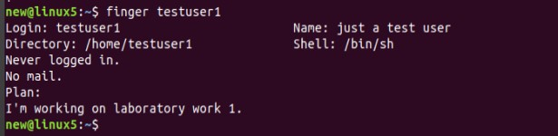

8. Used `ls -la` to list all the contents in home directory *( - for file, d - for directory ) 

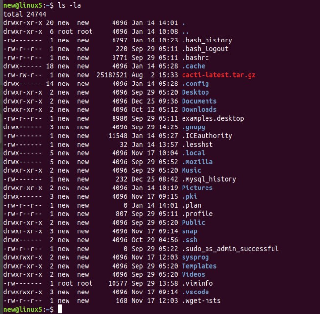

### PART 2

