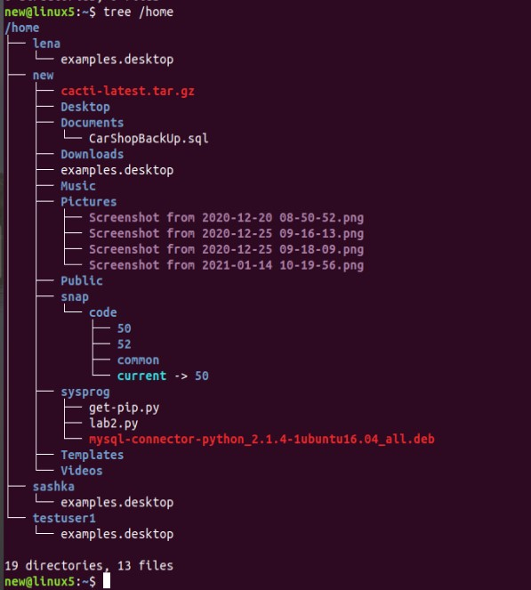
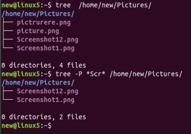
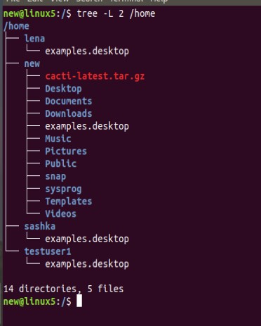
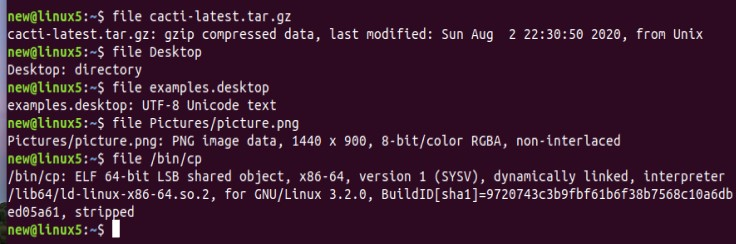
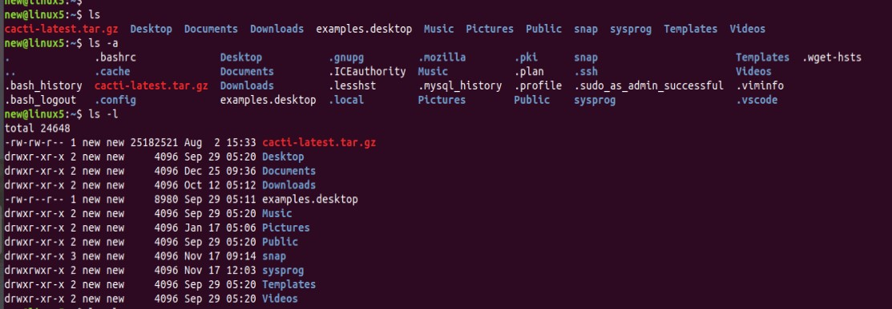
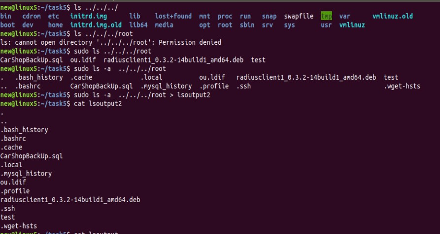
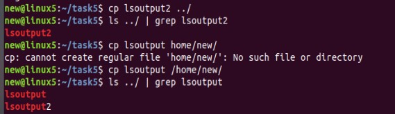
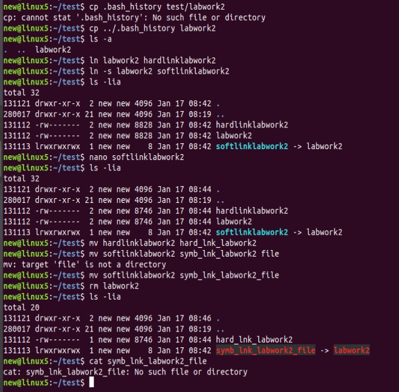
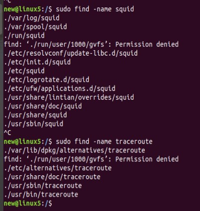
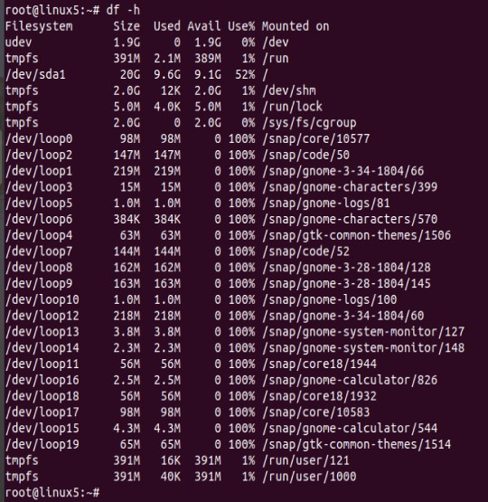

# Module 5 Linux

## TASK 5.1 

### PART 1

1. Logged in as root and changed password.

Password change has changed system files /etc/passwd and /etc/shadow, because they contain the user's password.

2. Command passwd has the next parameters:

3. List of users:

Users permisions: 

Logged in as a testuser1 and checked the permisions:

4. Added a description to testuser1 with the help of command `sudo usermod -c 'just a test user' testuser1`:

Then tried `chfn testuser1` command:

5. Tested 2 commands `--help` *(shows short description about of options)*  and `man` *(shows full description of command)*

6. Explored `more` and `less` commands and the main difference is that less command is faster because it does not load the entire file at once and allows navigation though file using page up/down keys and it has a useful feature - `/word-to-seach` option

7. Described in plans that I'm working on laboratory work 1:

8. Used `ls -la` to list all the contents in home directory *( - for file, d - for directory ) 

### PART 2

1. `tree` command examples:

2. To determine the file type it can be used `file` command or `ls -l` output:

3. `cd` is a command for navigating in file system. If it is used without any options it moves user to the home directory.

4. Tried `ls` with different options. The most used 2 options are `-a`(shows list of all the content, including hidden, in current directory and `-l` 
(show detailed (file type, rights, owner, group, date, size) list of content.

5. IO operation from the created subdirectory in home directory:

6. Operations with links:

So, what is the difference between hard and soft links? Hard link is a copy of the main file, but if hard link or main file were changed - both will be changed.
Also hard link is partly independent file comparing to soft link. If you delete the main file, hard link will continue to exist, whenever soft link is just a link to file,
so it will stop showing the data.

7. Found files that contain squid and traceroute sequences:

8. Partitions:

9. 
