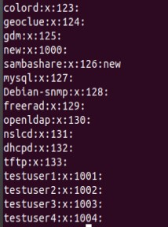
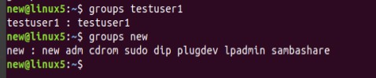
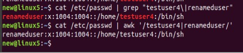
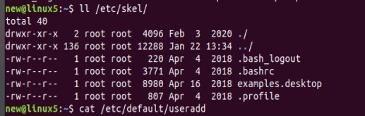
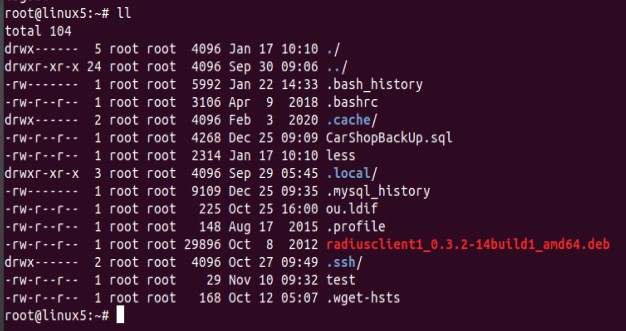

# Module 5 Linux

## TASK 5.2

1. The /etc/passwd contains one entry per line for each user of the system. All fields are separated by a colon (:) symbol. 
Total of seven fields as follows.

- Username
- Password: An x character indicates that encrypted password is stored in `/etc/shadow` file.
- User ID (UID): Each user must be assigned a user ID (UID). UID 0 (zero) is reserved for root and UIDs 1-99 are reserved for other predefined accounts.
Further UID 100-999 are reserved by system for administrative and system accounts/groups.
- Group ID (GID): The primary group ID (stored in `/etc/group` file)
- User ID Info: The comment field. It allow you to add extra information about the users such as user’s full name, phone number etc. This field use by `finger` command.
- Home directory: The absolute path to the directory the user will be in when they log in. If this directory does not exists then users directory becomes `/`
- Command/shell: The absolute path of a command or shell (`/bin/bash`).

  The `/etc/group` stores group information or defines the user groups i.e. it defines the groups to which users belong. There is one entry per line,
  and each line has the following format (all fields are separated by a colon (:)
  
  
  
 - group_name
 - Password: An x character indicates that encrypted password is stored in `/etc/shadow` file.
 - Group ID (GID): Each user must be assigned a group ID. You can see this number in your /etc/passwd file.
 - Group List: It is a list of user names of users who are members of the group. The user names, must be separated by commas.

2. A UID (user identifier) is a number assigned by Linux to each user on the system. This number is used to identify the user to the system and to determine
which system resources the user can access. 
Each user must be assigned a user ID (UID). UID 0 (zero) is reserved for root and UIDs 1-99 are reserved for other predefined accounts.
Further UID 100-999 are reserved by system for administrative and system accounts/groups.

3. Groups in Linux are defined by GIDs (group IDs). Just like with UIDs, the first 100 GIDs are usually reserved for system use. 
The GID of 0 corresponds to the root group and the GID of 100 usually represents the users group. 

4. The ways how to determine belonging of user to the specific group:

- `/etc/group` file, which stores group information or defines the user groups.

- `groups` command. If it's used without options, it shows all groups. If you type also username, so it will show all groups user belongs.

- `getent group groupname` command will show all users the specific group contains.

5. Command `useradd` is used to add user in a system.

Most used options: 
- `-D` sets default values
- `-c` to add short description
- `-g` to set a group
- `-U` automaticaly create group with the same name as the user

6. `sudo usermod -l renameduser testuser4` command was used to change the username:

7. Directory /etc/skel/ (skel is derived from the “skeleton”) is used to initiate home directory when a user is first created
A sample layout of “skeleton” user files is:

8. `sudo userdel -r testuser2` was used to delete user including his mailbox.

9. `usermod -L username` to lock user

`usermod -U username` to unlock user

10.

11. Used `ll` to display extended format of information about the directory:

So fields here mean:

    - file permissions,
    - number of (hard) links ,
    - owner name 
    - owner group 
    - file size in bytes 
    - time of last modification 
    - file/directory name
    
 12. 

    
