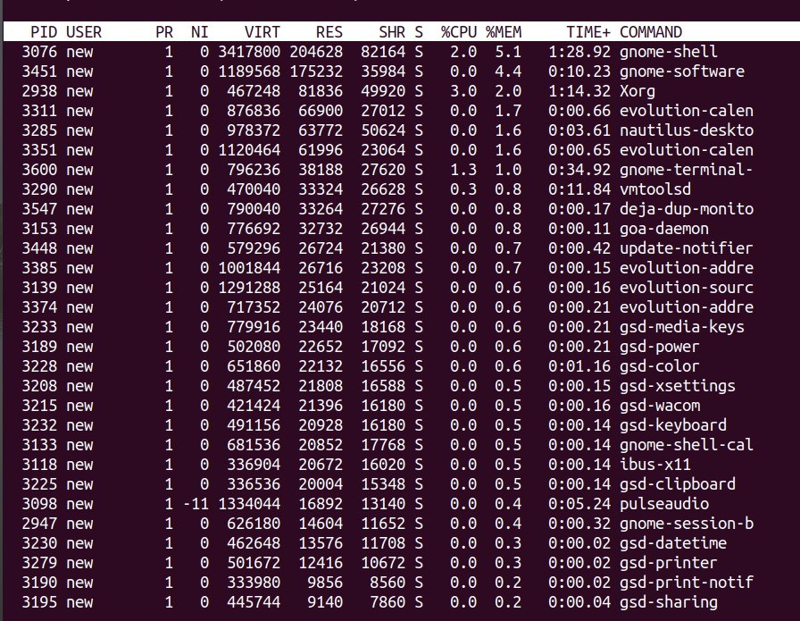
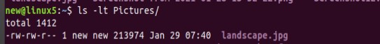
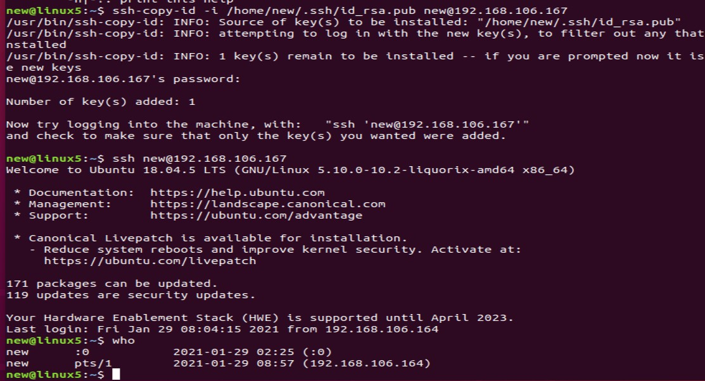

# Module 5 Linux

## TASK 5.3

### PART 1

1. Linux process states:

 
Running

    The process is either running (it is the current process in the system) or it is ready to run 
    (it is waiting to be assigned to one of the system's CPUs). 
Waiting

    The process is waiting for an event or for a resource. Linux differentiates between two types of waiting process;
    interruptible and uninterruptible. Interruptible waiting processes can be interrupted by signals whereas uninterruptible
    waiting processes are waiting directly on hardware conditions and cannot be interrupted under any circumstances. 
Stopped

    The process has been stopped, usually by receiving a signal. A process that is being debugged can be in a stopped state. 
Zombie

    This is a halted process which, for some reason, still has a task_struct data structure in the task vector.
    It is what it sounds like, a dead process. 

       
2. `pstree` - display a tree of processes

3. `/proc` is very special in that it is also a virtual filesystem. It doesn't contain 'real' files but runtime system information (e.g. system memory, devices mounted, hardware configuration, etc). For this reason it can be named as a control and information centre for the kernel. By the way, quite a lot of system utilities are simply calls to files in this directory. For example, 'lsmod' is the same as 'cat /proc/modules' while 'lspci' is a synonym for 'cat /proc/pci'. By altering files located in this directory you can even read/change kernel parameters (sysctl) while the system is running.

4.  `/proc/cpuinfo` - contains info about cpu

5. `ps -eo euser,ruser,suser,fuser,f,stat,start,time,comm,label`

6. User processes have its own virtual address space.

Kernel processes don't have their own address space, they operate within kernel address space only. And they may be started before the kernel has started any user process. Also, they have PID less than 1000.

7.  As ps documentation says there can be the next states of processes:

         D    uninterruptible sleep (usually IO)
         R    running or runnable (on run queue)
         S    interruptible sleep (waiting for an event to complete)
         T    stopped by job control signal
         t    stopped by debugger during the tracing
         W    paging (not valid since the 2.6.xx kernel)
         X    dead (should never be seen)
         Z    defunct ("zombie") process, terminated but not reaped by ts parent
  
  
 8.  `ps aux | grep username`
 
 
 
 9. 
 
  
  
  10.  The top program provides a dynamic real-time view of a running system.  It can display system
   summary information as well as a list of processes or threads currently being managed by  the
   Linux kernel.  The types of system summary information shown and the types, order and size of
   information displayed for processes are all user configurable
       
  11.  Using `top | grep new` :
 
  
  
   Using hotkey: `<U>`
 
 
  
  
  12. 
  
          <Shift>+<N>—sort by PID;
          <Shift>+
—sort by CPU usage;
          <Shift>+<M>—sort by Memory usage;
          <Shift>+<T>—sort by Time usage;
          <Shift>+<Z> —change colors;
          <c> - display absolute path of command;

13. Sorted by memory usage:

         press <Shift>+<f> to enter the interactive menu;
         press the up or down arrow until the %MEM choice is highlighted;
         press <s> to select %MEM choice;
         press <enter> to save your selection;
         press <q> to exit the interactive menu;

14. There are a total of 140 priorities and two distinct priority ranges implemented in Linux.
The first one is a nice value (niceness) which ranges from -20 (highest priority value) to 19 (lowest priority value)
and the default is 0, this is what we will uncover in this guide. The other is the real-time priority, 
which ranges from 1 to 99 by default, then 100 to 139 are meant for user-space.

Priority sort can be set in the same way as it was in the previous point.

15. `top` command is required for spectating the proccesses, while commands `nice` and `renice` are required for
managing the priorities of processes.

16. The most common kill signals are:

17. `jobs` - lists all jobs

`bg %n` - places the current or specified job in the background, where n is the job ID

`fg %n` - brings the current or specified job into the foreground, where n is the job ID

`Control-Z` -	stops the foreground job and places it in the background as a stopped job

`nohup` -  ignores the HUP signal. It makes the processes immune to HUP signals in order to make the program run even after log out

### PART 2

1. The most frequently used OpenSSH commands:

     `ssh-keygen` - creates a key pair for public key authentication

     `ssh-copy-id` - configures a public key as authorized on a server

     `ssh-agent` - agent to hold private key for single sign-on

     `ssh-add` - tool to add a key to the agent

     `scp` - file transfer client with RCP-like command interface

     `sftp` - file transfer client with FTP-like command interface

     `sshd` - OpenSSH server
     

     

2. Used `ssh-keygen` command to create ssh key pair and sent public key to VM1 `192.168.106.164`:

Than connected to VM2 `192.168.106.167` from VM1 `192.168.106.164`:

3. I've used these options:

`-f` - to set the filename

`-t` - to set a cipher 

`-b` - to set the key size

4. VM1 network adapters (NAT, internal): 

VM2 network adapters (internal): 

Setting up a port forwarding: 

Result:

