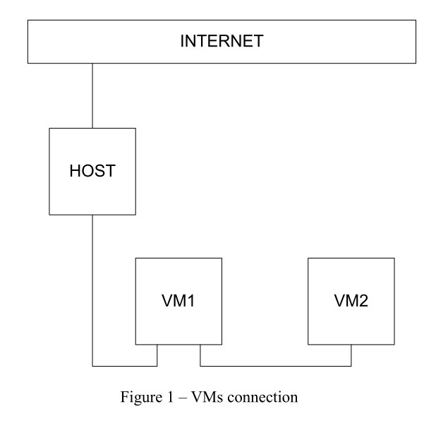
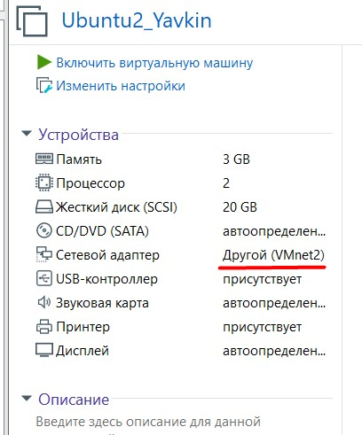
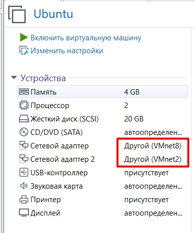

# Module 6 Linux

## TASK 6.1

1.  Created virtual machines connection according to figure 1: 

2. VM2 network adapter (VM2net is internal interface):

VM2 network adapters (VM2net is internal interface and VM8net is NAT interface):

VM2 iptables setup:

3. 
