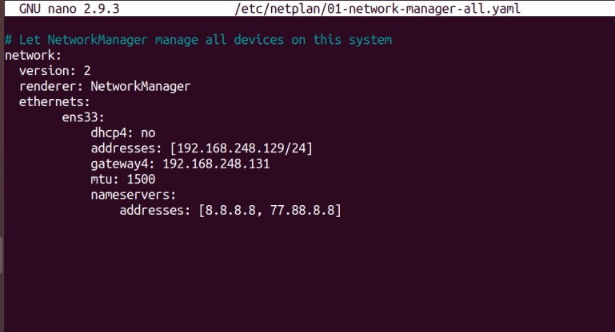
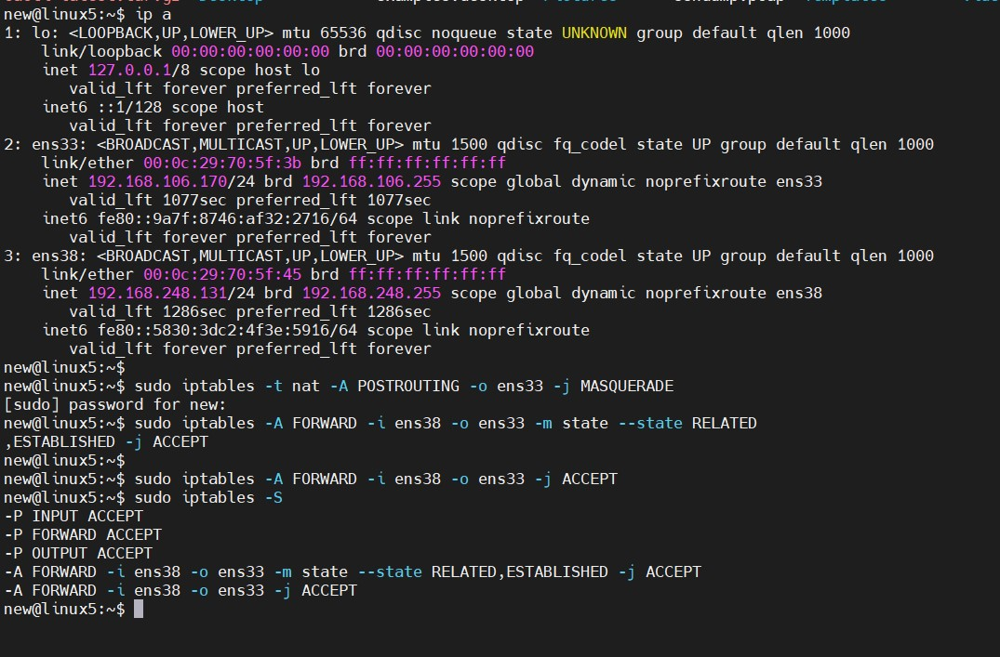
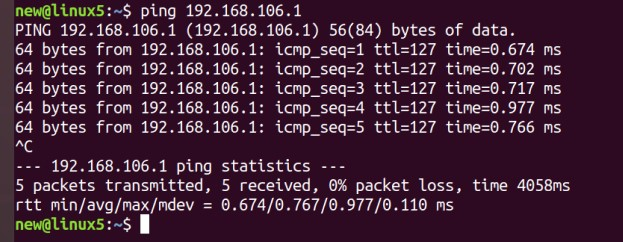
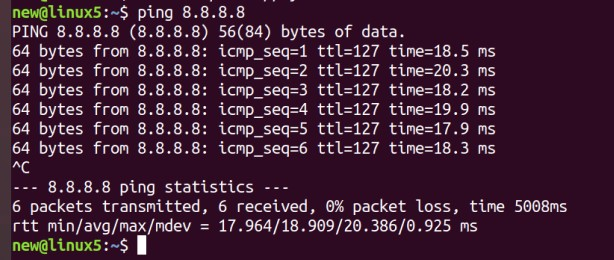
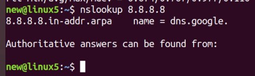
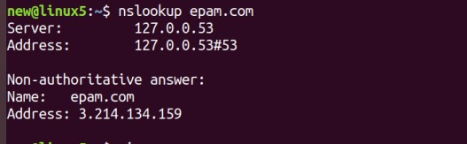
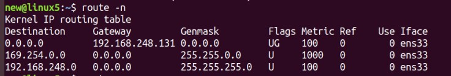
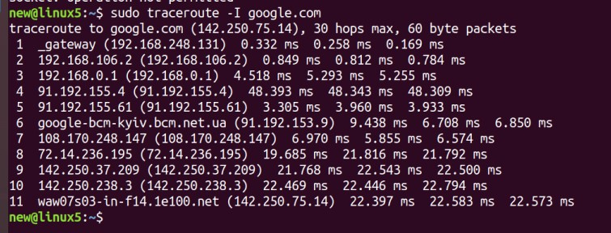

# Module 6 Linux

## TASK 6.1

1.  Created virtual machines connection according to figure 1: 

2. VM2 network adapter (VM2net is internal interface):

Netplan:

VM1 network adapters (VM2net is internal interface and VM8net is NAT interface):

VM1 iptables setup:

3.Check the route from VM2 to Host.

4. Check the access to the Internet, (just ping, for example, 8.8.8.8). 

\

5.  Determine, which  resource has an IP address 8.8.8.8. 

6. Determine, which  IP address belongs to resource epam.com. 

7. Determine the default gateway for your HOST and display routing table. 

8. Trace the route to google.com. 

