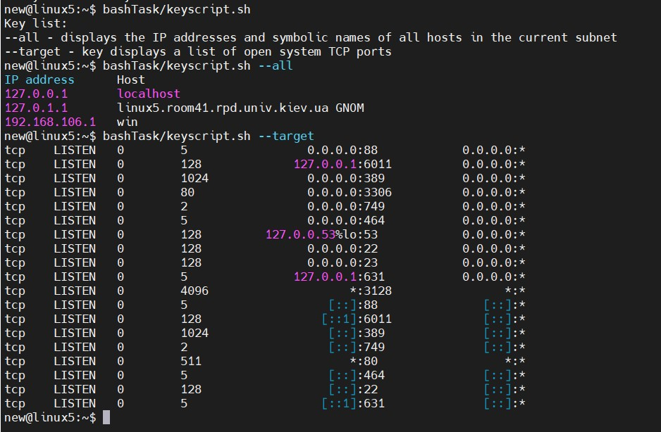
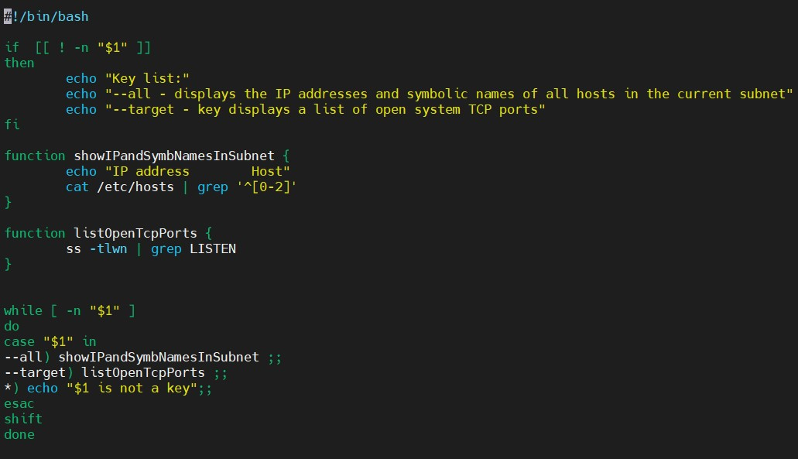

# Module 7 Linux administration with bash

## TASK 7.1

### PART A

Testing script:

Script: https://github.com/Balroggggg/-DevOps_online_Kyiv_2020Q42021Q1/blob/master/m7/task7.1/keyscript.sh

### PART B

Script: https://github.com/Balroggggg/-DevOps_online_Kyiv_2020Q42021Q1/blob/master/m7/task7.1/apacheLogAnaliser.sh

1. From which ip were the most requests?

2.  What is the most requested page?  

3. How many requests were there from each ip?  

4.  What non-existent pages were clients referred to?  

5.  What time did site get the most requests?  

6.  What search bots have accessed the site?

### PART С

Script: https://github.com/Balroggggg/-DevOps_online_Kyiv_2020Q42021Q1/blob/master/m7/task7.1/dataBackup.sh

Testing script: 

1. Created a syncing directory

2. Started cron job

3. Added and deleted some files

