# Module 8 Jenkins

## TASK 8.1

Simple deploy using `scp` command:

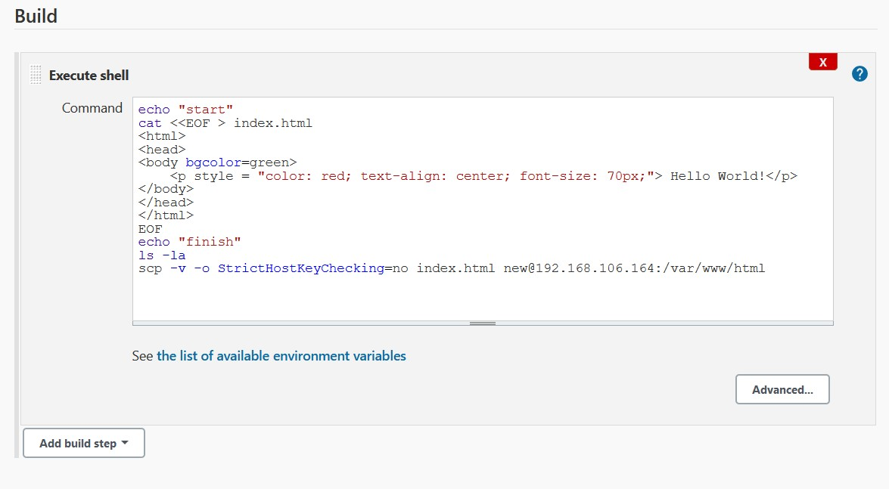

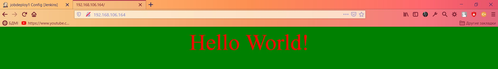

Simple deploy using plugin `Publish Over SSH`:

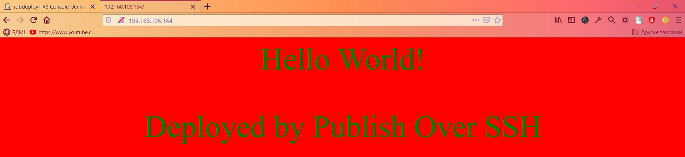

Deploy using Github repository as a source:

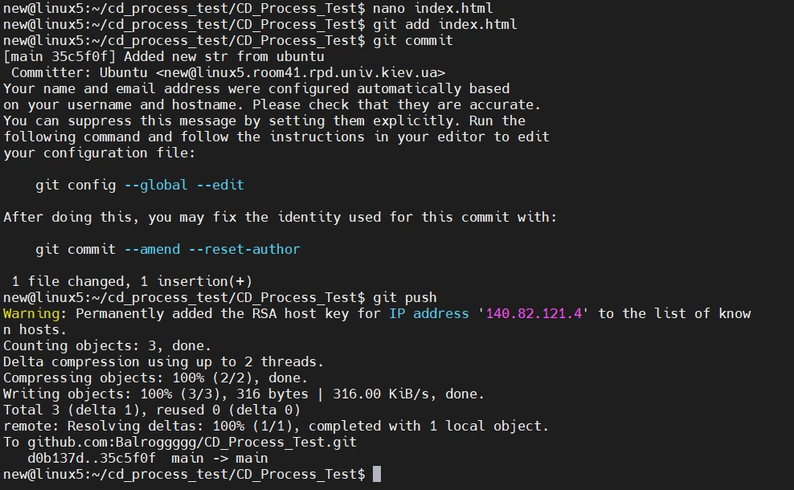

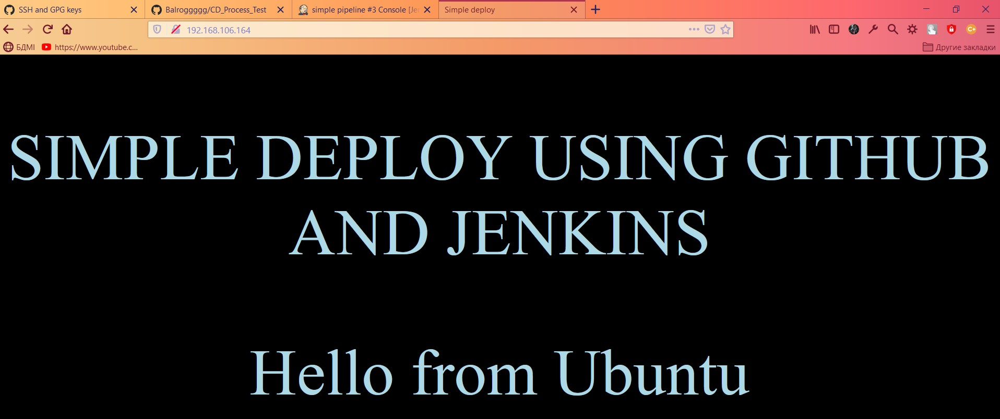

The same deploy, but using EC2 instances:

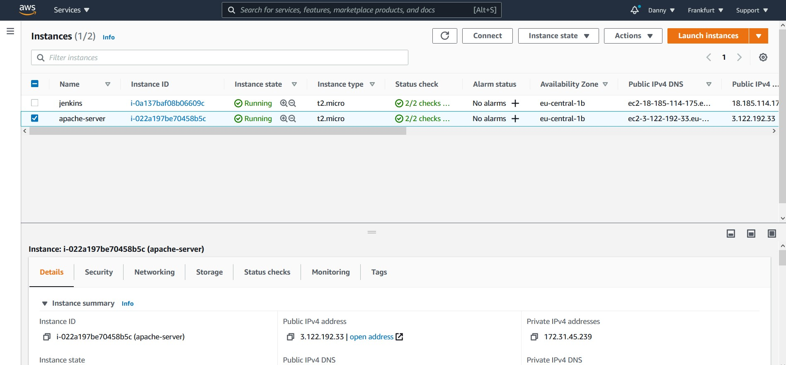

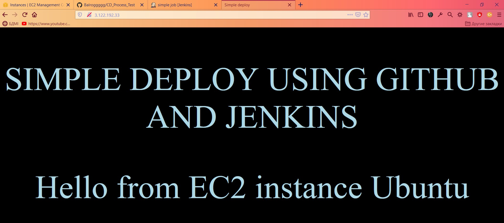

Auto deploy using github webhook:

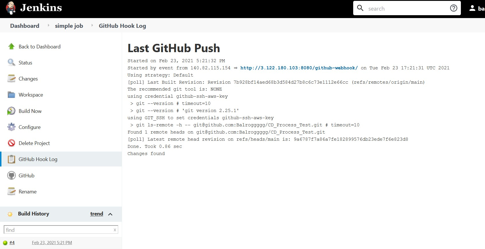

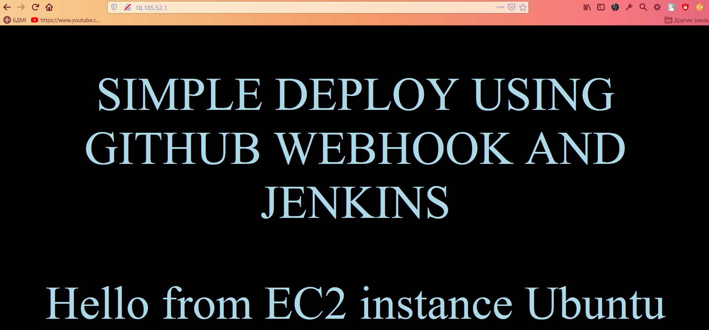

Deploy using slaves:

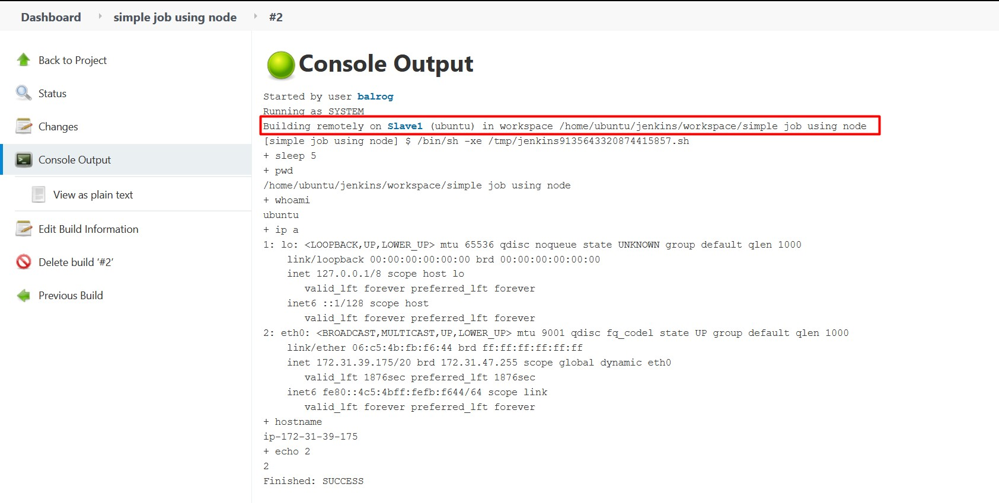

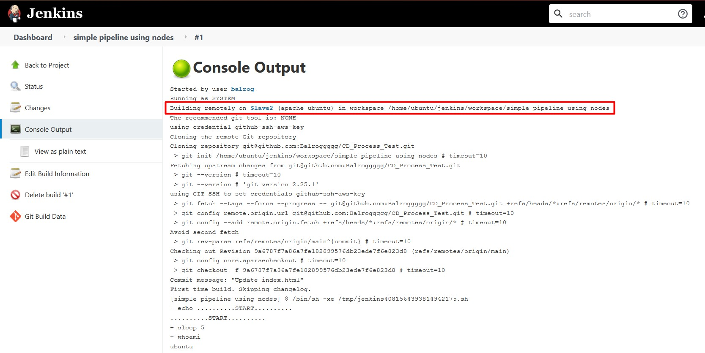

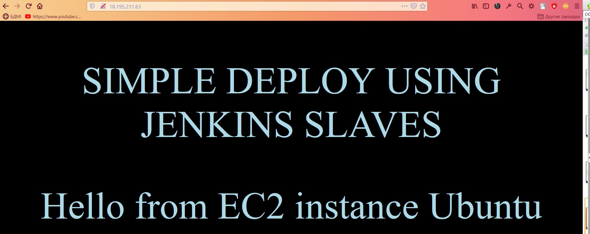

Simple pipeline:

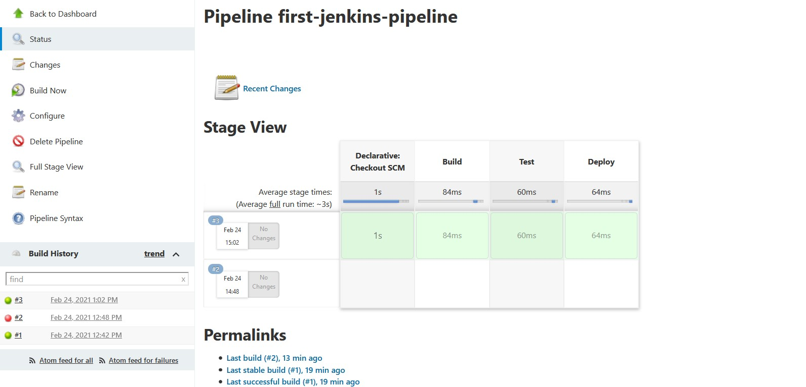

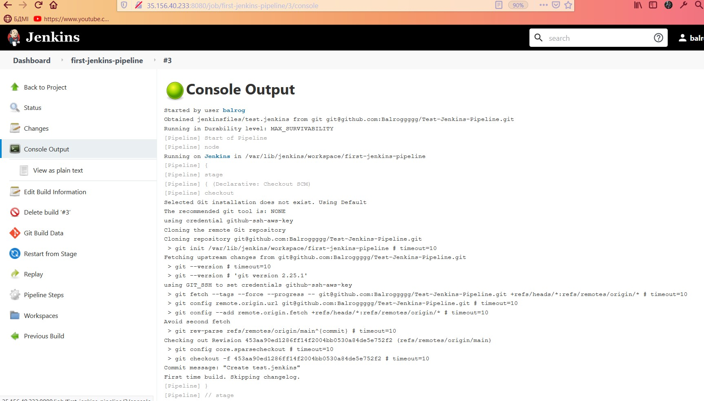

Deploy and build maven app:

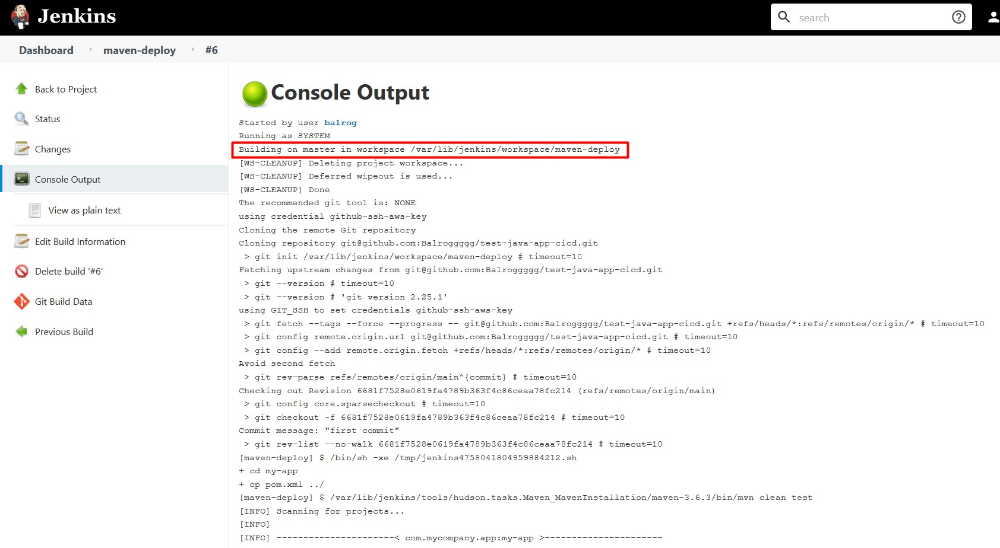

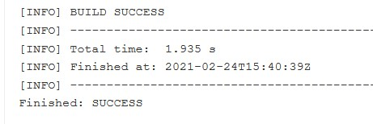

