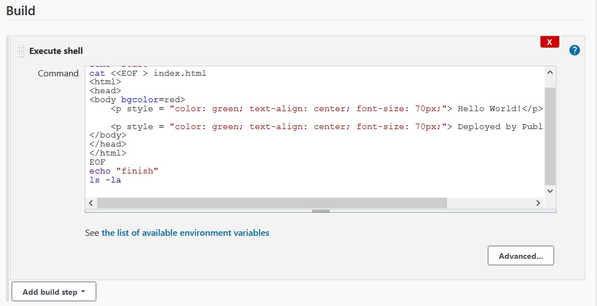

# Module 8 Jenkins

## TASK 8.1

Simple deploy using `scp` command:

Simple deploy using plugin `Publish Over SSH`:

Deploy using Github repository as a source:

The same deploy, but using EC2 instances:

Auto deploy using github webhook:

Deploy using slaves:

Simple pipeline:

Deploy and build maven app:

