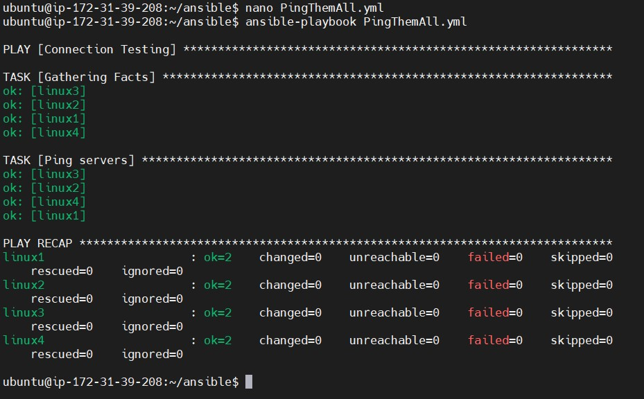
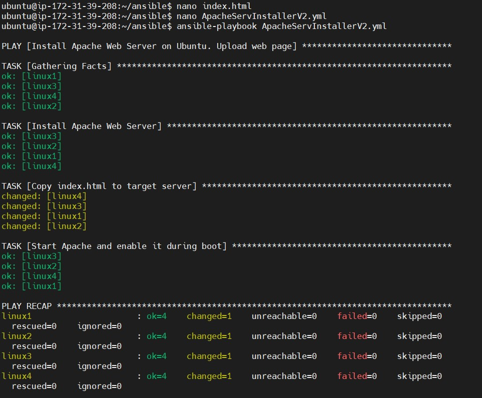
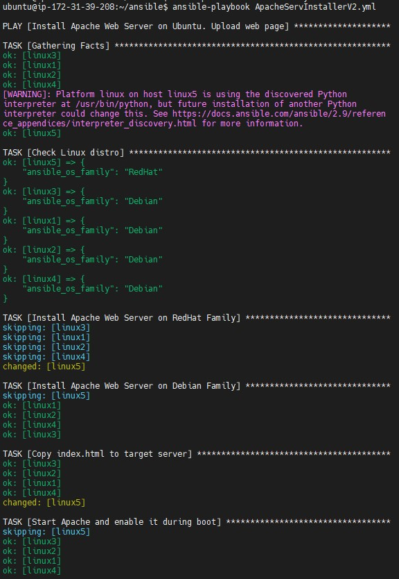
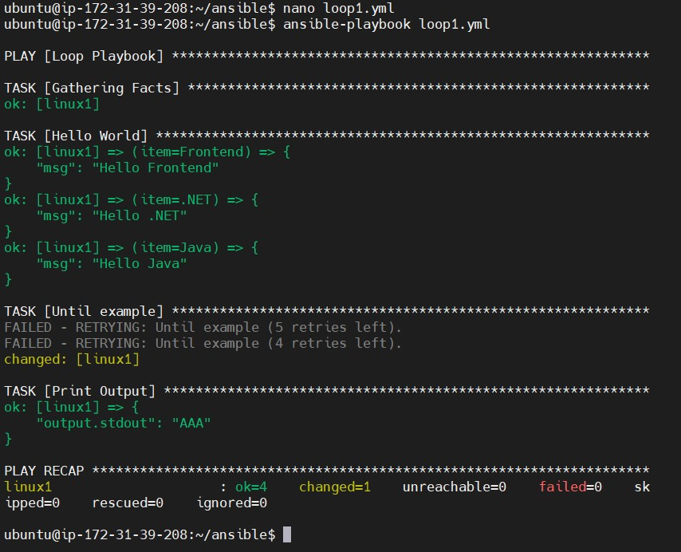
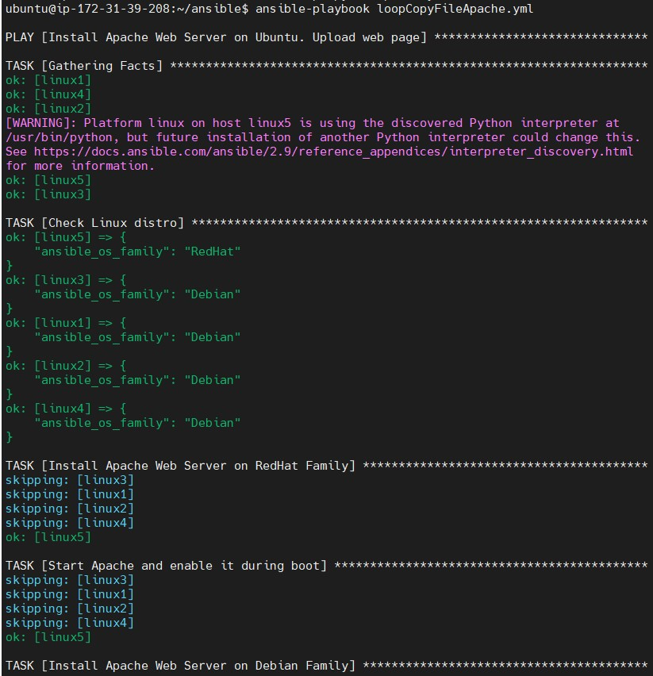
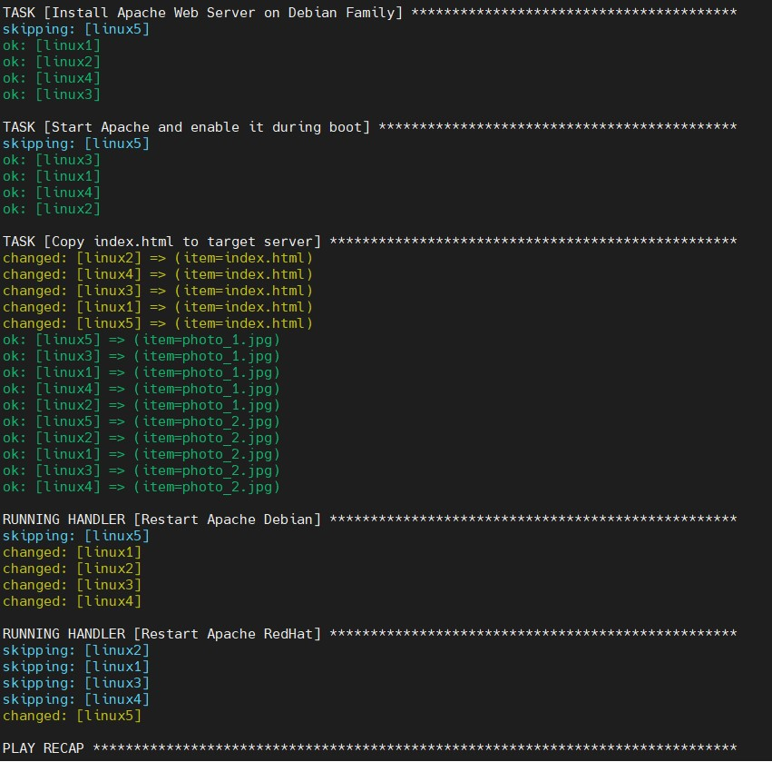
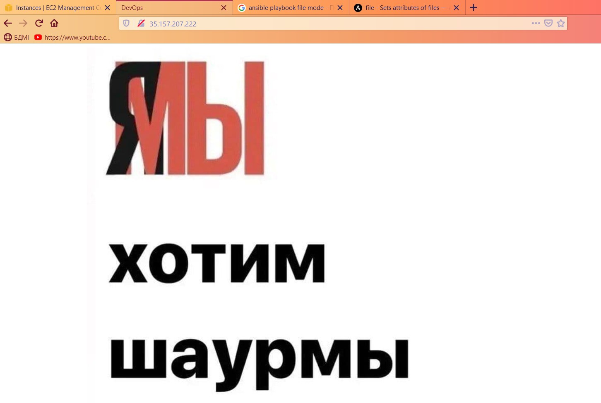
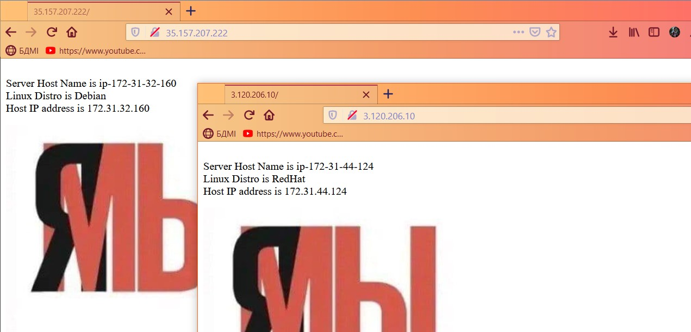
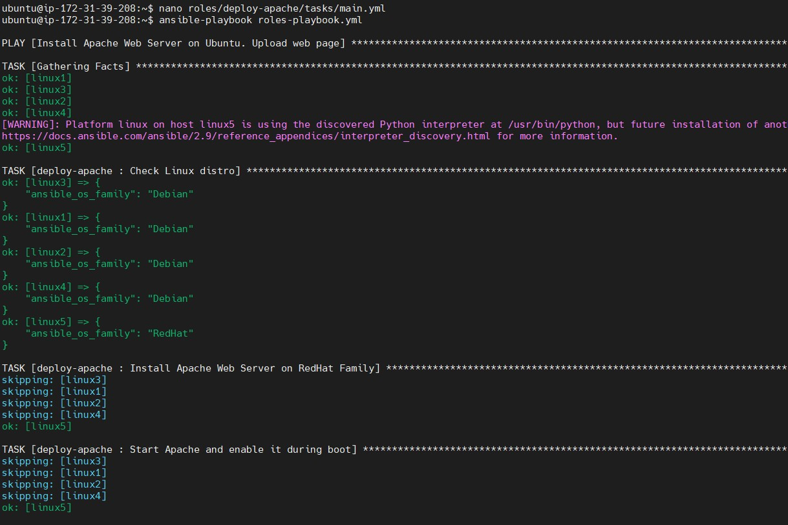
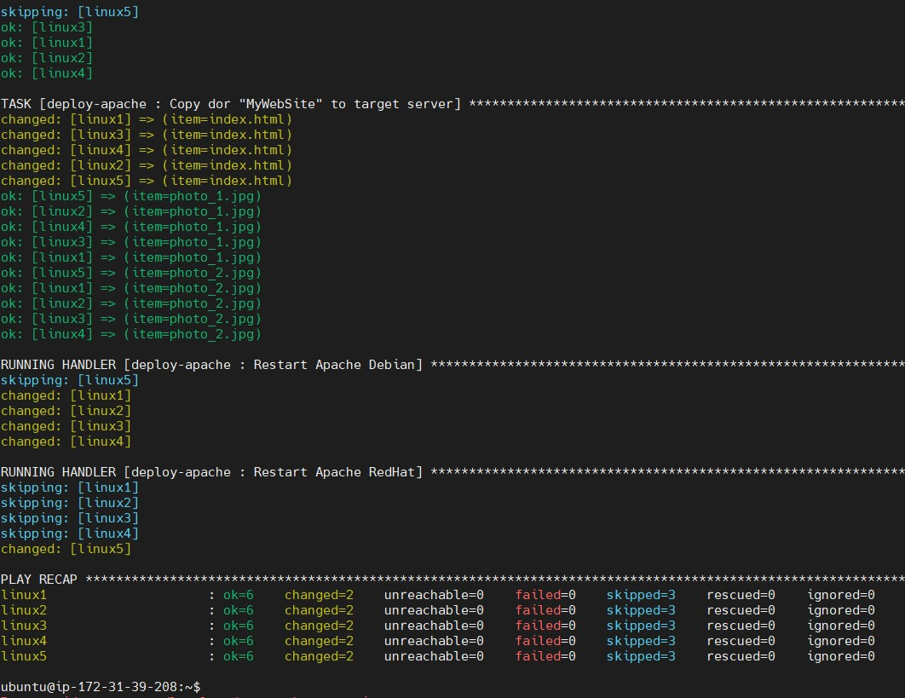

# Module 10 Ansible

## TASK 10

1. Test connection to all servers, owned by your organization. 
Assumed, that you have credentials to do this action 

2. Install Apache Web Server on all servers, owned by your organization. 
Also needed to start Apache Web Server and enable it during boot

3. Install Apache Web Server on all servers, owned by your organization. 
Also needed to start Apache Web Server and enable it during boot. 
Also needed to change default index.html

4. Task: Install Apache Web Server on all servers, owned by your organization. 
Also needed to start Apache Web Server and enable it during boot. 
Also needed to change default index.html. Servers are on different Linux-based OS

5. Make some actions on remote server, 
Results should be viewed by output console

6. Copy WebPage (some files) to remote server using loop

7. Customize WebPage on remote servers using template and jinja

8. Deploy same WebPage, but using roles

